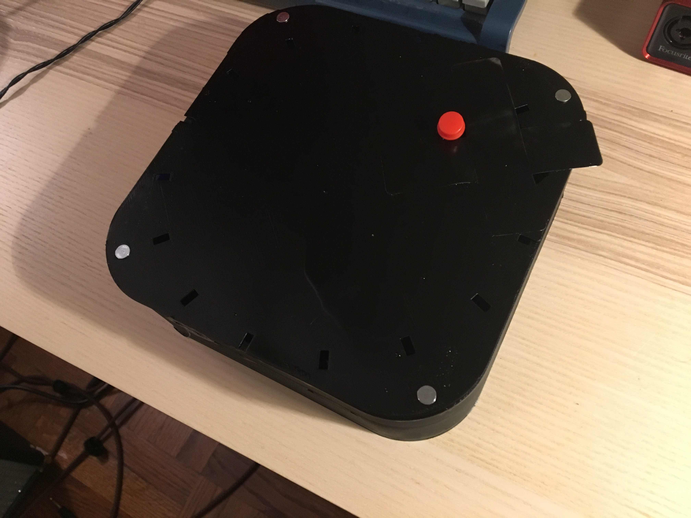
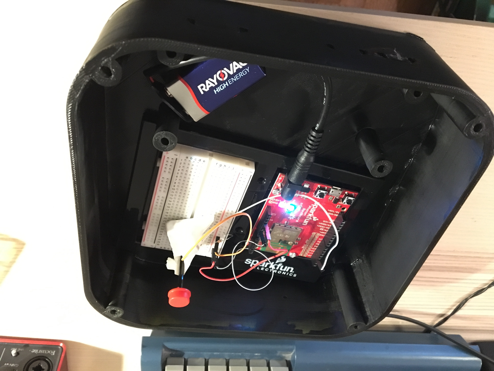

# Midterm IoT Project

Name: Robert Steilberg / rhs16

Date: 12 October 2017

## Project: MoistureMachine


### Conceptual Description

MoistureMachine is a critical response to the concept of open data, data ownership, and corporate cloud surveillance and privacy. At its core, MoistureMachine is a comprehensive system for monitoring the environment around a plant, but importantly, all data collected by the microcontroller is always available and proactively delivered to the user.

MoistureMachine conforms to the principles of open data and user ownership through the following functionalities:

1. Every four hours, the user is sent an email that contains all data points recorded by MoistureMachine during the previous four hourly runs (the time between each run can be customized, such as once every two hours with a report every eight hours)
2. Data can be visualized in real-time through an applet on the Blynk platform
3. The user can see the current soil saturation reading on the onboard OLED screen


### Form

/// Your project should be embodied in a ***physical form*** that reflects, embodies, and/or amplifies those your project's main concepts and ideas.
Explain your design choices here and include images that document your project's material embodiment. ///

When considering an enclosure for my device, it was important to leave both the OLED screen and temperature sensor exposed so that they could respectively convey and record accurate data. The moisture sensor obviously had to be left exposed since it had to be placed in the plant soil. Importantly, I wanted the user to be able to easily move the moisture sensor to different parts of the soil, so I attached longer wires to make the sensor easily moveable.

I wanted the rest of the enclosure to be relatively exposed and safe from the external environment. I used a cardboard box to make a platform that the plant could sit on top of so that I could place the microcontroller underneath. The OLED screen and temperature sensor require use of the breadboard, so one end of the breadboard is partially exposed so that those components are visible. This way, the user can easily glance at the plant and see the current saturation percentage, and the temperature sensor can properly record readings from the environment.

**Finished Enclosure:**



**Electronics Exposed:**



### Technical Details

The following pieces of hardware were used:

* SparkFun Photon Redboard
* Half+ breadboard
* SparkFun Micro OLED Breakout
* RHT03 Temperature and Humidity sensor
* SparkFun Soil Moisture Sensor

The source repository for the MoistureMachine can be found [here](https://github.com/robertsteilberg/MoistureMachine). The firmware is linked [here](https://github.com/robertsteilberg/MoistureMachine/blob/master/src/MoistureMachine.ino).

The firmware initializes by starting the OLED screen, initializing the soil moisture sensor, configuring the RHT03 sensor, subscribing to the `rob-camila` event, and initializing the Blynk communication protocol. Then, a loop is executed with a delay based off of a definition property. The loop is configured by default to run every hour.

Each iteration of the loop begins by reading the RHT03 and soil moisture sensor. The saturation reading is calibrated and scaled to a percentage so that it is easily understandable by the user. This percentage is then printed to the OLED screen. The following code describes the algorithm used to scale raw readings (`rawReading`) to a percentage. The `baseline` value corresponds to the value read when the soil is completely dry.

```
int scaleReading(int rawReading) {
  int baseline = 2200;
  int max = 3300;
  if (rawReading < baseline) {
    return 0;
  }
  return (int)((rawReading - baseline) * ((float)100 / (float)(max - baseline)));
}
```

After reading sensor data, the values are pushed to Blynk so that users can monitor their data in real-time. Then, an event is published to `rob-camila`, triggering Camila Vargas' device to sound a tone from its Piezo speaker.

Afterwards, the sensor data is summarized in a string that is added to a `summary` instance variable containing all data points collected thus far. After four runs of the loop, the `DATA_REPORT` event is published, and the `summary` instance variable is pushed along with it. Via IFTTT, this string is placed in the body of an email sent to the user summarizing all data collected in the four runs.

Lastly, the `summary` instance variable is cleared, the number of runs reset, and the loop repeats after the time described by `DELAY`.

There is also a function, `externalAlert`, that accepts an event `rob-camila` published by Camila Vargas' device. When the event is received, its payload is printed to the OLED screen.

**Wiring Diagram**


